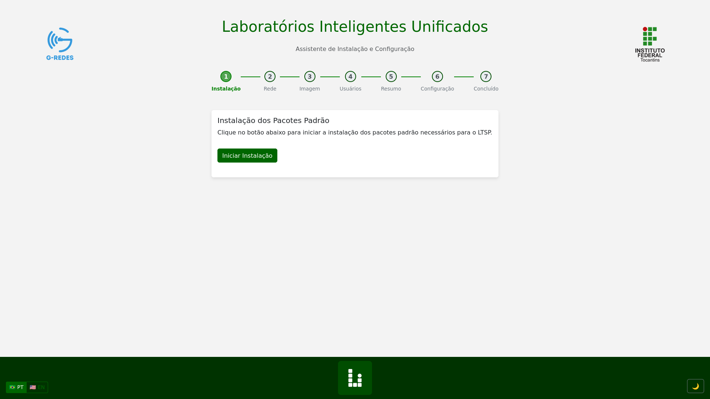

# 🧠 LiU — Unified Intelligent Laboratories

&#x20;

**LiU** is a solution based on [LTSP](https://ltsp.org/) that provides an **integrated platform for lab management**, with **user-friendly interfaces** and **web tools** to simplify the **configuration** and **monitoring** of lab environments.

> **💡 Mission:** Reuse equipment, optimize processes, and expand access to technology through innovation in computer labs.

## 🖼️ System Interface

---

## 🚀 Features

- 🌐 Web interface for managing terminals
- 🖥️ Real-time monitoring of devices
- 🔧 Tools for automated LTSP client setup
- ♻️ Reuse of old machines as thin clients
- 📊 Dashboard with usage statistics

---

## 🛠️ Technologies Used

- 🐧 **Linux Terminal Server Project (LTSP)**
- 🐍 Python
- 🌐 HTML, CSS, and JavaScript
- 🧰 Bash scripts
- ⚙️ Flask for dynamic web pages

---

## 📦 Installation

> **Prerequisites:** Ubuntu 22.04 or higher with root access.
>                    Keep all the client machines ON during installation (Some features need to scan these machines).
>                     

```bash
# Clone the repository
git clone https://github.com/oseliim/LiU

# Enter the directory
cd LiU

# Run the installation script
chmod +x autorun.sh
sudo ./autorun.sh
```
> **Pos-Installation:** For better performance, keep all the client machines ON, just turn off when extremely necessary.
>                       For bettter performance, turn the client machines ON hours before a class.
>                       

---

## 📄 License

- 📘 See full license text: [https://www.gnu.org/licenses/gpl-3.0.en.html](https://www.gnu.org/licenses/gpl-3.0.en.html)
