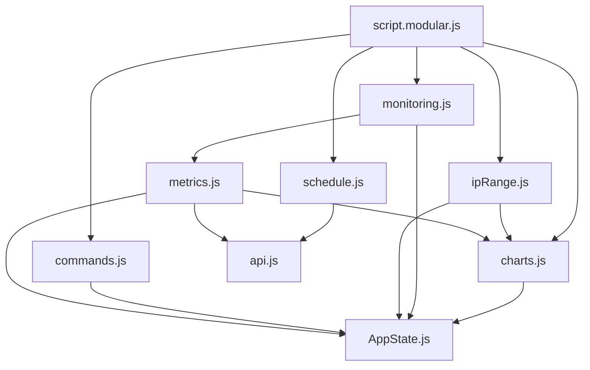

# Documentação da Modularização do JavaScript

## Visão Geral

Este documento descreve a modularização realizada no arquivo `script.js` da interface de gerenciamento de laboratório, transformando um arquivo monolítico de 792 linhas em uma arquitetura modular baseada em ES6 Modules.

## Estrutura Anterior vs. Nova

### Antes da Modularização
- **Arquivo único**: `script.js` (792 linhas)
- **Problemas identificados**:
  - Código monolítico difícil de manter
  - Variáveis globais espalhadas
  - Funções interdependentes misturadas
  - Dificuldade para reutilização de código
  - Complexidade para debugging e testes

### Após a Modularização
- **Arquivo principal**: `script.modular.js` (15 linhas)
- **Módulos especializados**: 8 arquivos em `modules/`
- **Total de linhas**: ~500 linhas distribuídas
- **Benefícios**:
  - Separação clara de responsabilidades
  - Código reutilizável e testável
  - Manutenção simplificada
  - Imports explícitos de dependências

## Arquitetura dos Módulos

### 1. AppState.js - Gerenciamento de Estado Global
**Responsabilidade**: Centralizar o estado da aplicação

```javascript
export const AppState = {
    monitoringInterval: null,
    charts: {},
    activeView: 'server',
    activeClientIp: null
};
```

**Funções exportadas**:
- `setActiveView(view)`: Define a vista ativa (server/client)
- `setActiveClientIp(ip)`: Define o IP do cliente selecionado
- `clearMonitoringInterval()`: Limpa o intervalo de monitoramento
- `setMonitoringInterval(id)`: Define novo intervalo de monitoramento

### 2. api.js - Camada de Comunicação
**Responsabilidade**: Abstrair chamadas HTTP para o backend

**Funções exportadas**:
- `postJson(endpoint, body)`: Requisições POST com JSON
- `getJson(endpoint)`: Requisições GET com JSON

**Características**:
- Tratamento centralizado de erros
- Headers padronizados
- Retorno consistente (dados ou null)

### 3. charts.js - Gerenciamento de Gráficos
**Responsabilidade**: Configuração e atualização de gráficos Chart.js

**Funções exportadas**:
- `initCharts(prefix)`: Inicializa gráficos (CPU, memória, rede)
- `updateChart(chart, newValue)`: Atualiza gráfico simples
- `updateDualChart(chart, uploadValue, downloadValue)`: Atualiza gráfico duplo

**Configurações**:
- 60 pontos de dados por gráfico
- Cores padronizadas por métrica
- Animações suaves
- Responsividade automática

### 4. metrics.js - Coleta de Métricas
**Responsabilidade**: Buscar e processar dados de sistema

**Funções exportadas**:
- `updateCpuInfo()`: Atualiza informações de CPU
- `updateMemoryInfo()`: Atualiza informações de memória
- `updateDiskInfo()`: Atualiza informações de disco
- `updateNetworkInfo()`: Atualiza informações de rede
- `updateFunctions`: Mapeamento de métricas para funções

**Características**:
- Suporte a vista servidor e cliente
- Prefixos dinâmicos para elementos DOM
- Integração automática com gráficos

### 5. monitoring.js - Sistema de Monitoramento
**Responsabilidade**: Gerenciar monitoramento em tempo real

**Funções exportadas**:
- `startMonitoring(metric)`: Inicia monitoramento de métrica específica
- `setupMetricIconClicks()`: Configura cliques nos ícones de métricas
- `setupSseStatusMonitoring(startButton)`: Configura monitoramento SSE

**Características**:
- Intervalo de 2.5 segundos
- Server-Sent Events para status das máquinas
- Gerenciamento automático de intervalos

### 6. ipRange.js - Gerenciamento de Faixa de IP
**Responsabilidade**: Configuração e navegação entre máquinas

**Funções exportadas**:
- `attachIpRangeHandler(ipRangeForm, monitoringWrapper)`: Configura formulário de IP
- `generateMachineButtons(range)`: Gera botões dinâmicos para máquinas
- `setupBackToServer()`: Configura navegação de volta ao servidor

**Características**:
- Validação de formato de IP
- Geração dinâmica de interface
- Transições suaves entre vistas

### 7. commands.js - Execução de Comandos
**Responsabilidade**: Gerenciar execução de comandos remotos

**Funções exportadas**:
- `setupCommandButtons()`: Configura botões de controle (ligar/desligar)
- `setupCommandForms()`: Configura formulários de comando

**Características**:
- Streaming de saída em tempo real
- Suporte a comandos individuais e em lote
- Tratamento de erros de rede

### 8. schedule.js - Sistema de Agendamento
**Responsabilidade**: Gerenciar tarefas agendadas (cron)

**Funções exportadas**:
- `setupSchedule()`: Configura formulário de agendamento
- `setupScheduleViewer()`: Configura visualização de agendamentos

**Características**:
- Validação de expressões cron
- Frequências: diária, semanal, mensal
- Interface para remoção de tarefas

## Arquivo de Entrada - script.modular.js

```javascript
import { initCharts } from './modules/charts.js';
import { setupMetricIconClicks, setupSseStatusMonitoring } from './modules/monitoring.js';
import { attachIpRangeHandler, setupBackToServer } from './modules/ipRange.js';
import { setupCommandButtons, setupCommandForms } from './modules/commands.js';
import { setupSchedule, setupScheduleViewer } from './modules/schedule.js';

document.addEventListener('DOMContentLoaded', function() {
    const ipRangeForm = document.getElementById('ip-range-form');
    const monitoringWrapper = document.getElementById('monitoring-wrapper');
    const startButton = document.getElementById('startButton');

    initCharts();
    setupMetricIconClicks();
    setupSseStatusMonitoring(startButton);
    attachIpRangeHandler(ipRangeForm, monitoringWrapper);
    setupBackToServer();
    setupCommandButtons();
    setupCommandForms();
    setupSchedule();
    setupScheduleViewer();
});
```

## Fluxo de Dependências



## Migração e Compatibilidade

### Como Migrar
1. **Manter compatibilidade**: O arquivo `script.js` original foi preservado
2. **Migração gradual**: Trocar referência no HTML:
   ```html
   <!-- Antes -->
   <script src="../static/js/script.js"></script>
   
   <!-- Depois -->
   <script type="module" src="../static/js/script.modular.js"></script>
   ```

### Pré-requisitos
- **Chart.js**: Deve ser carregado antes do script modular:
  ```html
  <script src="https://cdn.jsdelivr.net/npm/chart.js"></script>
  <script type="module" src="../static/js/script.modular.js"></script>
  ```

### Dependências Externas
- **Bootstrap 5.3.0**: Para componentes UI
- **Chart.js**: Para gráficos em tempo real
- **ES6 Modules**: Suporte nativo do navegador

## Benefícios da Modularização

### 1. Manutenibilidade
- **Código organizado**: Cada módulo tem responsabilidade única
- **Fácil localização**: Problemas específicos ficam isolados
- **Modificações seguras**: Mudanças não afetam outros módulos

### 2. Reutilização
- **Funções exportadas**: Podem ser reutilizadas em outros projetos
- **APIs claras**: Interfaces bem definidas entre módulos
- **Testabilidade**: Cada módulo pode ser testado independentemente

### 3. Performance
- **Carregamento otimizado**: Apenas módulos necessários são carregados
- **Tree shaking**: Bundlers podem eliminar código não utilizado
- **Cache eficiente**: Módulos podem ser cacheados individualmente

### 4. Desenvolvimento
- **Debugging simplificado**: Stack traces mais claros
- **Colaboração**: Múltiplos desenvolvedores podem trabalhar em módulos diferentes
- **Versionamento**: Mudanças podem ser rastreadas por módulo

## Estrutura de Arquivos

```
files/interface_gerencia/static/js/
├── script.js                    # Arquivo original (preservado)
├── script.modular.js           # Novo arquivo de entrada
├── dark_mode.js                # Módulo existente (não modificado)
└── modules/
    ├── AppState.js             # Estado global
    ├── api.js                  # Comunicação HTTP
    ├── charts.js               # Gráficos Chart.js
    ├── commands.js             # Execução de comandos
    ├── ipRange.js              # Gerenciamento de IPs
    ├── metrics.js              # Coleta de métricas
    ├── monitoring.js           # Monitoramento em tempo real
    └── schedule.js             # Sistema de agendamento
```

## Considerações Técnicas

### ES6 Modules
- **Imports/Exports**: Sintaxe moderna e padronizada
- **Tree shaking**: Eliminação de código não utilizado
- **Lazy loading**: Carregamento sob demanda possível

### Compatibilidade
- **Navegadores modernos**: Suporte nativo a ES6 Modules
- **Fallback**: Arquivo original mantido para compatibilidade
- **CDN**: Dependências externas via CDN (sem npm local)

### Performance
- **Carregamento paralelo**: Módulos carregam simultaneamente
- **Cache**: Navegadores podem cachear módulos individualmente
- **Otimização**: Bundlers podem otimizar o código

## Próximos Passos

### 1. Testes
- Implementar testes unitários para cada módulo
- Testes de integração entre módulos
- Testes de regressão para funcionalidades existentes

### 2. Otimização
- Implementar lazy loading para módulos não críticos
- Adicionar bundling para produção
- Otimizar tamanho dos módulos

### 3. Documentação
- JSDoc para todas as funções exportadas
- Exemplos de uso para cada módulo
- Guias de contribuição

### 4. Ferramentas
- Linting específico para módulos
- Prettier para formatação consistente
- TypeScript para tipagem estática (opcional)

## Conclusão

A modularização realizada transformou um arquivo monolítico em uma arquitetura limpa e organizada, mantendo toda a funcionalidade original enquanto melhora significativamente a manutenibilidade e extensibilidade do código. A estrutura modular facilita futuras expansões e permite que a equipe trabalhe de forma mais eficiente e colaborativa.

A migração pode ser feita gradualmente, mantendo o arquivo original como fallback, garantindo zero downtime e permitindo validação completa da nova implementação antes da substituição definitiva.
